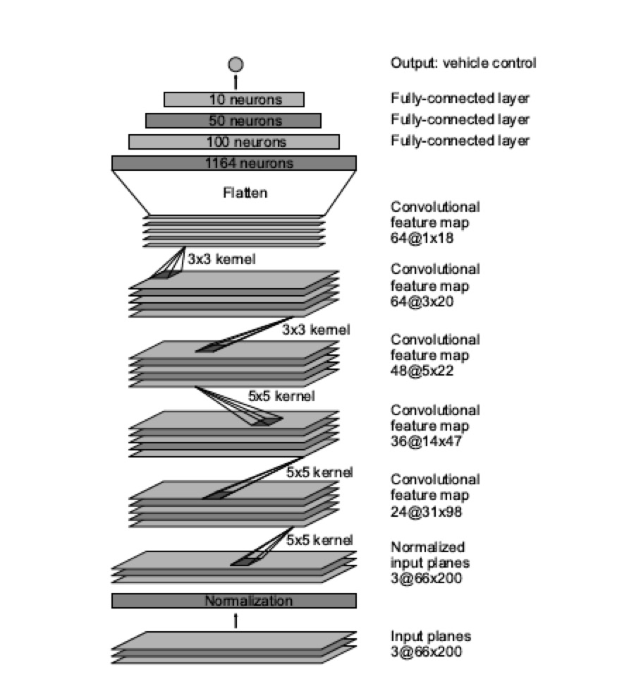
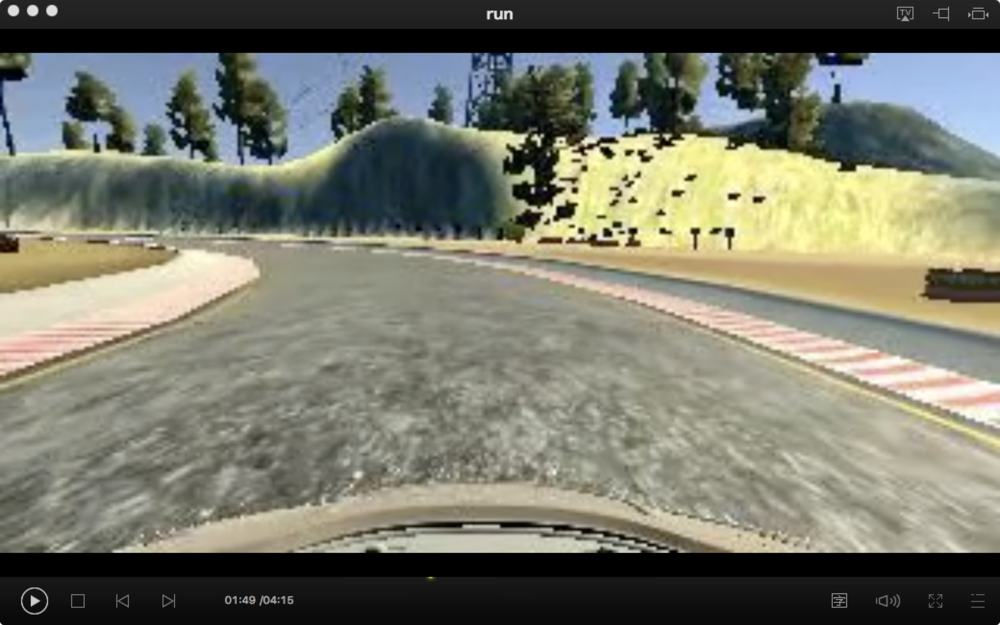
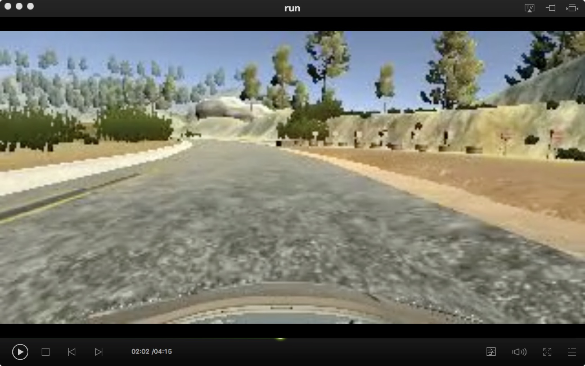
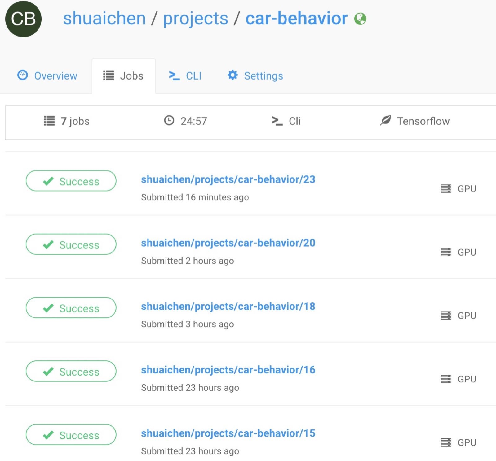

# End to End Learning for Self-Driving Cars

The goal of this project was to train a end-to-end deep learning model that would let a car drive itself around the track in a driving simulator. 

## Project structure

| File       | Description                              |
| ---------- | ---------------------------------------- |
| `model.py` | Methods related to data augmentation, preprocessing and batching. Implements model architecture and runs the training pipeline. |
| `model.h5` | Model weights.                           |
| `drive.py` | Implements driving simulator callbacks, essentially communicates with the driving simulator app providing model predictions based on real-time data simulator app is sending. |

## Data collection and balancing

balancing: To do......
## Data augmentation and preprocessing
- **Left and right cameras**.
  Along with each sample we receive frames from 3 camera positions: left, center and right. Although we are only going to use central camera while driving, we can still use left and right cameras data during training after applying steering angle correction,increasing number of examples by a factor of 3.
- **Horizontal flip**. For every batch we flip half of the frames horizontally and change the sign of the steering angle, thus yet increasing number of examples by a factor of 2.
```python
#augment and preprocess images
for line in lines[1:]:
	for i in range(3):
		source_path = line[i].strip()
		current_path = '/data/'+source_path
		image = cv2.imread(current_path)
		images.append(image)
		#flip data
		images.append(cv2.flip(image,1))
		measurement = float(line[3])
		#use three cameras
		if i == 0 :
			measurements.append(measurement)
			measurements.append(measurement*-(1.0))
		elif i == 1 :
			measurements.append(measurement+0.2)
			measurements.append(measurement*-(1.0)-0.2)
		else:
			measurements.append(measurement-0.2)
			measurements.append(measurement*-(1.0)+0.2)
```
- **Vertical shift**.
  To do ......
- **Random shadow**.
  To do ......
- **Resize image to 66\*200**.
  To do ......(This is a recommend size in our network)

## Model 

I utilized with the model described in [Nvidia paper](https://arxiv.org/abs/1604.07316) .
  
This model can be very briefly encoded with Keras. What's more, I add a layer to normalize input images.

```python
# Model from Nvidia paper
model = Sequential()
model.add(Lambda(lambda x: x/255.0 - 0.5, input_shape=(160,320,3)))
model.add(Cropping2D(cropping=((70,25),(0,0))))
model.add(Convolution2D(24,5,5,subsample=(2,2),activation="relu"))
model.add(Convolution2D(36,5,5,subsample=(2,2),activation="relu"))
model.add(Convolution2D(48,5,5,subsample=(2,2),activation="relu"))
model.add(Convolution2D(64,3,3,activation="relu"))
model.add(Convolution2D(64,3,3,activation="relu"))
model.add(Flatten())
model.add(Dense(100))
model.add(Dense(50))
model.add(Dense(10))
model.add(Dense(1))
```

## Results
<<<<<<< HEAD
=======

<p align="center">
>>>>>>> 35b3feac71d0071bd0c8ba71603d7c56c6ff4da3
  
  
<<<<<<< HEAD
  ## Train by FloydHub server
  
  - **command**.
 I have initiated files and uploaded data.
  ```
  floyd run --data shuaichen/datasets/car_train_data/3:/data --gpu --env tensorflow-1.1 "python model.py"
  ```
=======
</p>
>>>>>>> 35b3feac71d0071bd0c8ba71603d7c56c6ff4da3
